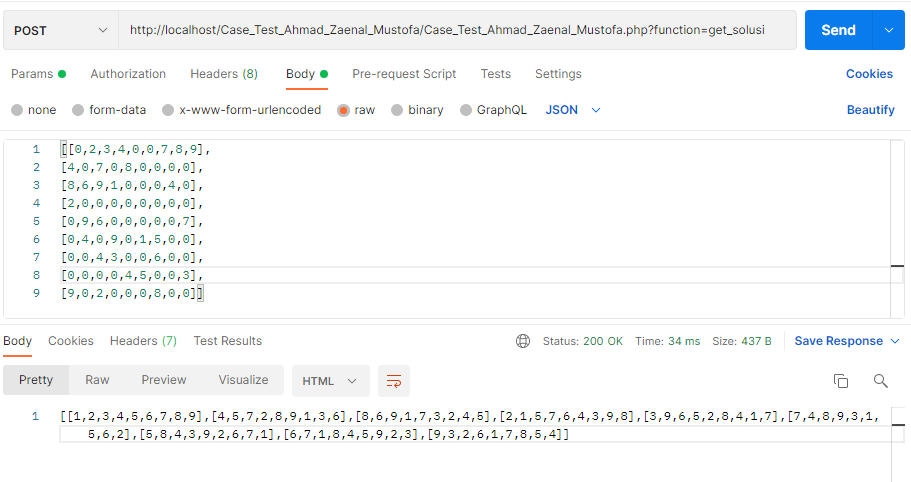

# Program untuk mencari solusi puzzle sudoku
## Case Test_Ahmad Zaenal Mustofa
akses API dengan postman/tools yg lainnya
http://localhost/Case_Test_Ahmad_Zaenal_Mustofa/Case_Test_Ahmad_Zaenal_Mustofa.php?function=get_solusi

Method: POST

inputan:
[
[0,2,3,4,0,0,7,8,9],
[4,0,7,0,8,0,0,0,0],
[8,6,9,1,0,0,0,4,0],
[2,0,0,0,0,0,0,0,0],
[0,9,6,0,0,0,0,0,7],
[0,4,0,9,0,1,5,0,0],
[0,0,4,3,0,0,6,0,0],
[0,0,0,0,4,5,0,0,3],
[9,0,2,0,0,0,8,0,0]
]

output:
[
[1,2,3,4,5,6,7,8,9],
[4,5,7,2,8,9,1,3,6],
[8,6,9,1,7,3,2,4,5],
[2,1,5,7,6,4,3,9,8],
[3,9,6,5,2,8,4,1,7],
[7,4,8,9,3,1,5,6,2],
[5,8,4,3,9,2,6,7,1],
[6,7,1,8,4,5,9,2,3],
[9,3,2,6,1,7,8,5,4]
]

# SS
